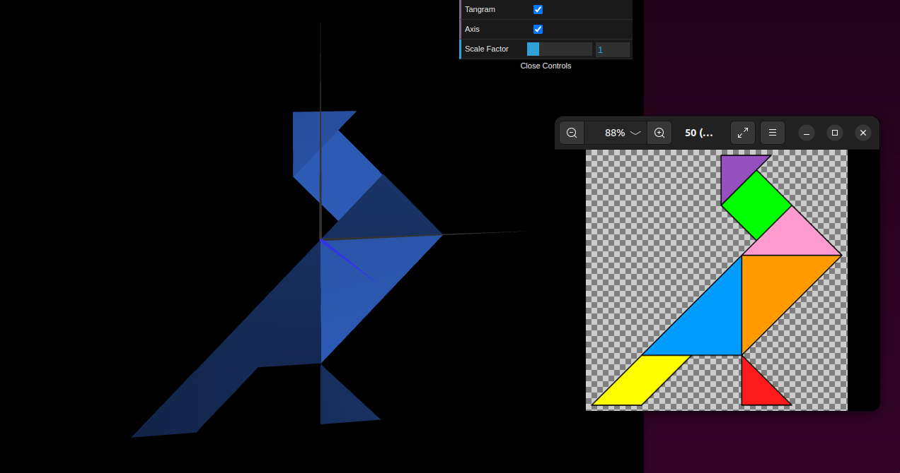
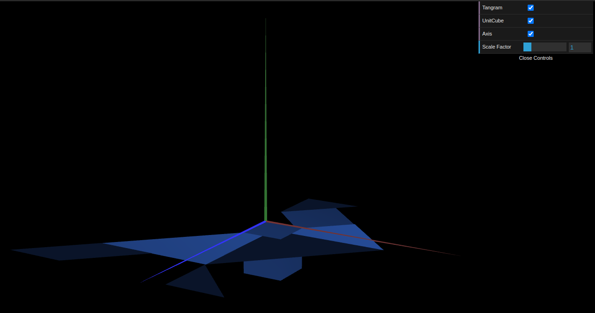
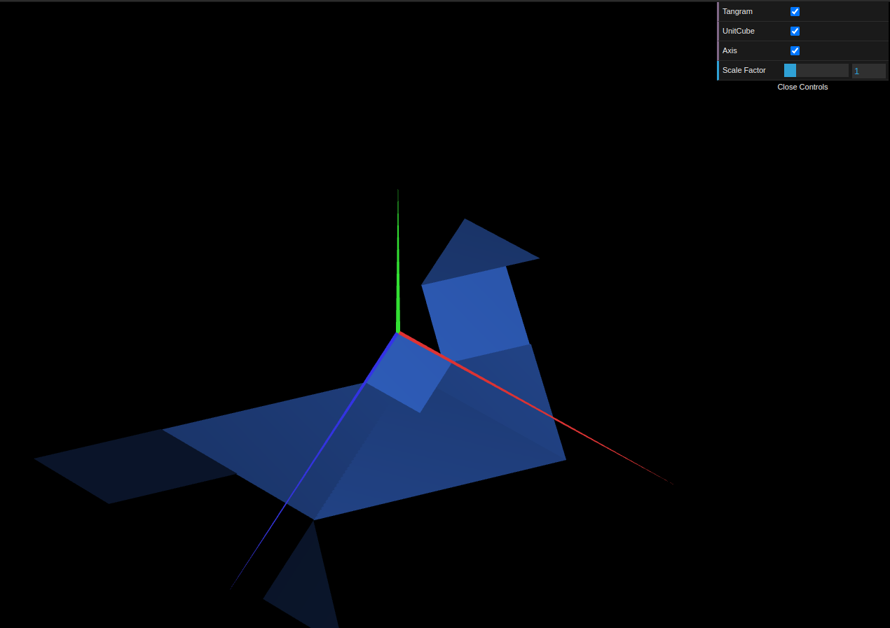
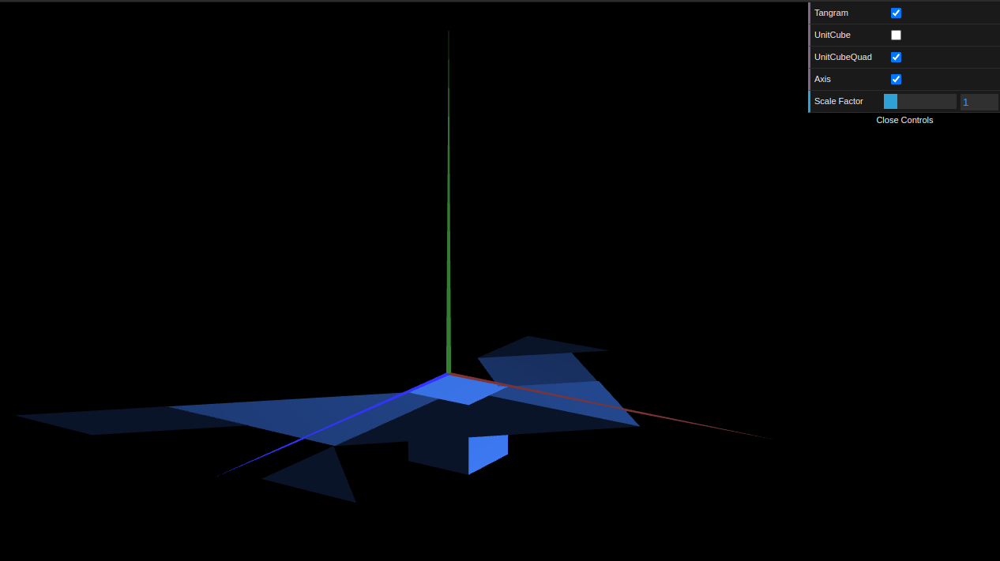

# CG 2022/2023

## Group T05G04

## TP 2 Notes

- No exercício 1, a partir das figuras criadas na aula TP1 foi possível criar uma única `MyTangram.js` através de transformações gráficas em 3D. A parte mais complicada foi organizar as peças, principalmente o "MyDiamond", porque nem sempre os valores a aplicar nas transformações são inteiros (diagonais dos triângulos). Adicionamos também uma *checkbox* para controlar a visibilidade do tangram.

Figure 1: Tangram

- No exercício 2 construímos um cubo unitário centrado na origem do referencial. Para isso foi necessário indicar as coordenadas dos 8 vértices e os 12 triângulos constituintes da malha, com principal atenção para que todas as faces externas do cubo ficassem visíveis. Combinamos as duas figuras anteriores e após rodarmos as mesmas pelo eixo X conseguimos com que ficassem paralelas ao plano XZ.

Figure 2: MyUnitCube

Figure 3: Tangram and UnitCube

- No exercício 3 construímos outro cubo unitário, desta vez usando um plano quadrado como base (constituído por sua vez por dois triângulos). Esta estratégia foi mais simples de implementar pois é modular. Ao substituirmos a figura "MyUnitCube" por "MyUnitCubeQuad" o aspeto final da composição manteve-se igual, tal como esperado.

Figure 4: Tangram and UnitCubeQuad
