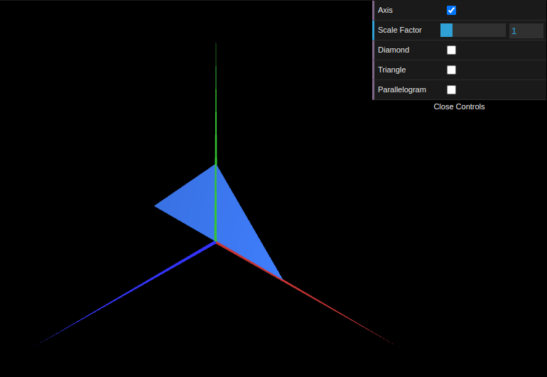

# CG 2022/2023

## Group T05G04

## TP 1 Notes

- No exercício 1, a partir do código base de `MyDiamond.js` foi possível criar `MyTriangle.js` com apenas um triângulo base e `MyParallelogram.js` com quatro triângulos: dois à frente e dois atrás. Em ambas as figuras adicionamos *checkboxes* para controlar a visibilidade de todas as figuras;
- No exercício 2, a partir do código de `MyTriangle.js` criamos as figuras `MyTriangleSmall` e `MyTriangleBig`;

Figure 1: MyTriangleSmall

Figure 2: MyTriangleBig
