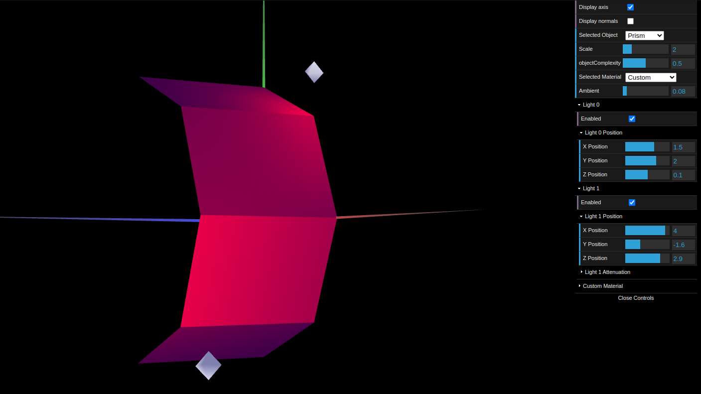
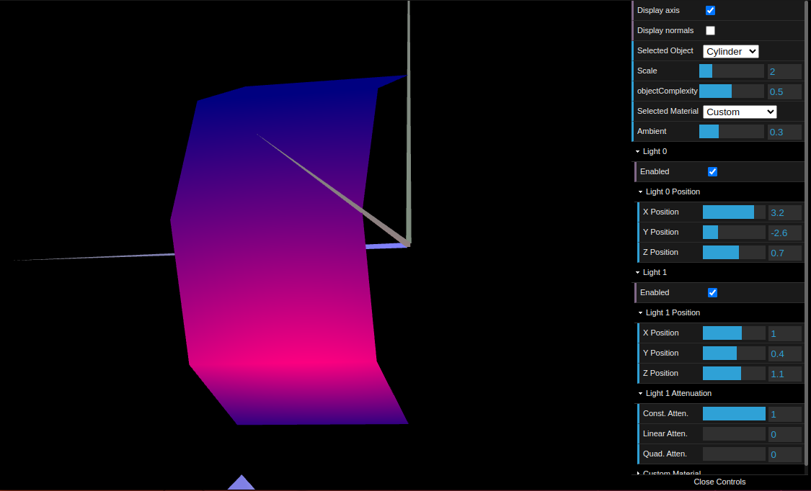

# CG 2022/2023

## Group T05G04

## TP 3 Notes

- No exercício 1, a partir das figuras criadas na aula TP1 e TP2 criamos todas as normais necessárias para que a luminosidade calculada fizesse sentido de acordo com o ângulo de incidência da luz e o ângulo de visualização. Criamos um material de cor semelhante a madeira com baixa componente especular.

Figure 1: Wood cube

Ainda no exercício 1 aplicamos vários materiais com alta componente especular às figuras presentes no tangram.

Figure 2: Tangram Materials

- No exercício 2 construimos um prisma com um número variável de lados e de complexidade. A parte mais desafiante foi implementar um algoritmo mais eficiente possível de modo a criar vértices, descrever a malha de triângulos e criar as normais normalizadas em cada vértice. A iluminação calculada foi semelhante à calculada com *Constant Shading* uma vez que as normais para uma mesma face são iguais.

Figure 3: Prism

- No exercício 3 as normais foram colocadas de maneira perpendiculares a cada aresta. Assim reduzimos o número de vértices e de normais a calcular. Tal como esperado as transições de de iluminação nas arestas foram suavizadas, ficaram menos aparentes e deu um aspeto curvo à superfície do prisma anterior.

Figure 4: "Cylinder"
