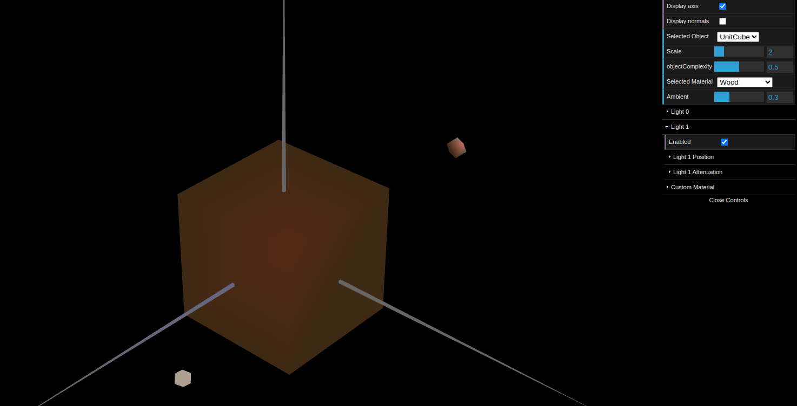
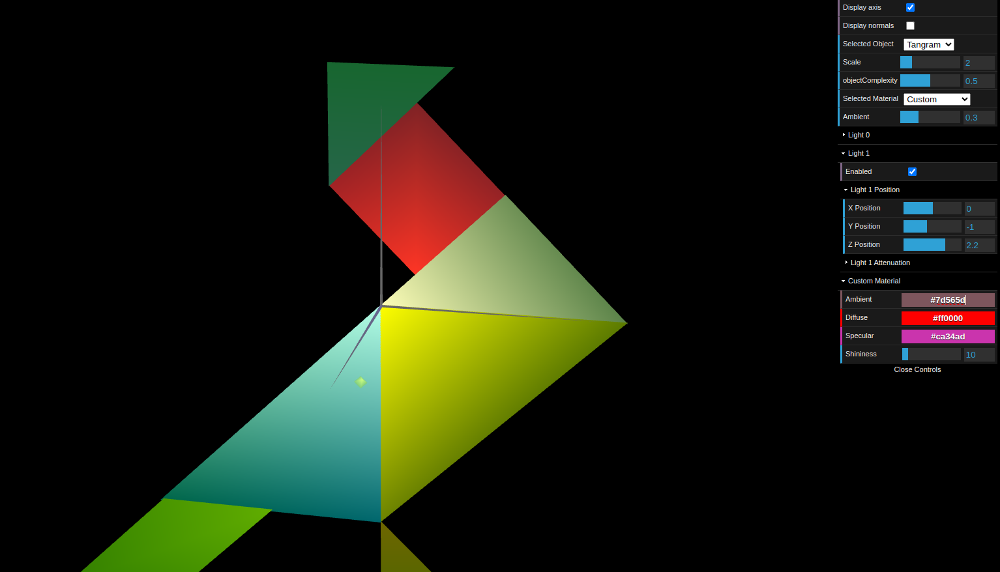

# CG 2022/2023

## Group T05G04

## TP 3 Notes

- No exercício 1, a partir das figuras criadas na aula TP1 e TP2 criamos todas as normais necessárias para que a luminosidade calculada fizesse sentido de acordo com o ângulo de incidência da luz e o ângulo de visualização. Criamos um material de cor semelhante a madeira com baixa componente especular.

Figure 1: Wood cube

Ainda no exercício 1 aplicamos vários materiais com alta componente especular às figuras presentes no tangram.

Figure 2: Tangram Materials
