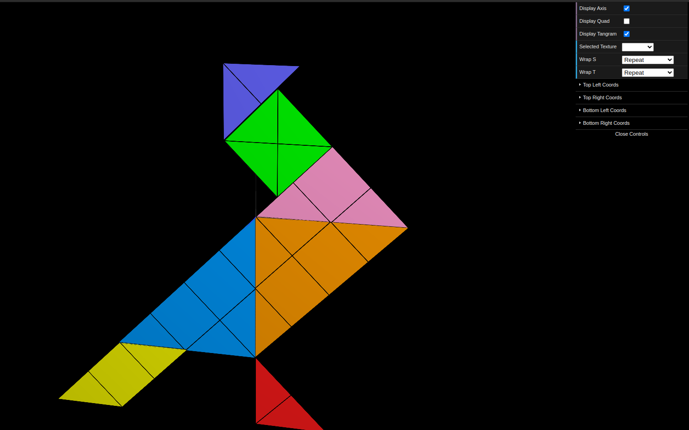
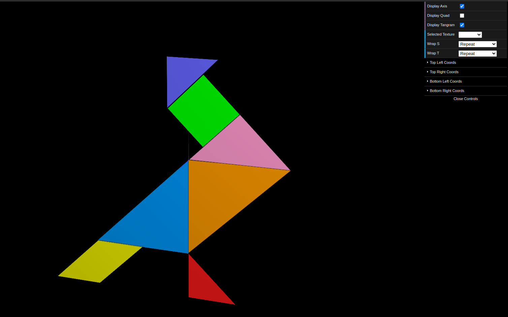
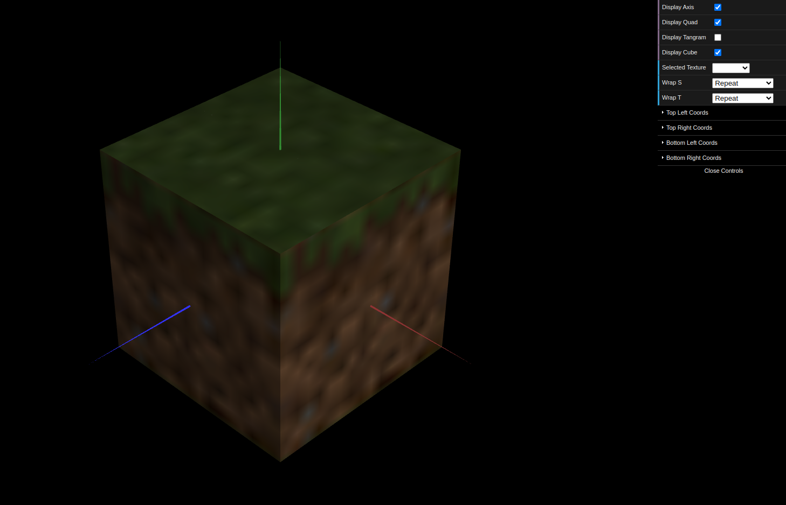

# CG 2022/2023

## Group T05G04

## TP 4 Notes

- No exercício 1 mapeamos a textura "tangram.png" em cada vértice de cada poligono da figura. O maior desafio foi definir as coordenadas de textura para cada polígono e entender a direção dos eixos aplicados na mesma. A textura auxiliar "tangram-lines.png" ajudou imenso a criar as partições necessárias.

Figure 1: Texture tangram-lines.png

Figure 2: Texture tangram.png

- No exercício 2 colocamos textura em todos os quadrados usados na classe MyUnitCubeQuad implementada na TP2. Uma vez que a imagem da textura é muito menor do que cada área a cobrir e o *default* é haver uma interpolação linear de cores, inicialmente a figura ficou desfocada. Ao alterar o tipo de filtragem, a imagem ficou nítida:

Figure 3: Minecraft cube

Figure 4: Minecraft cube
