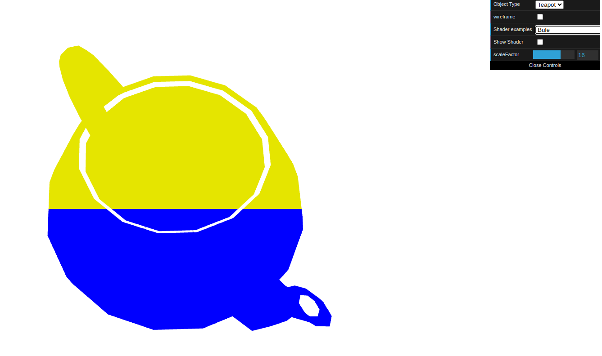
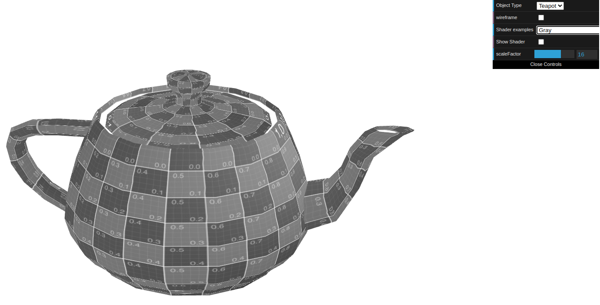
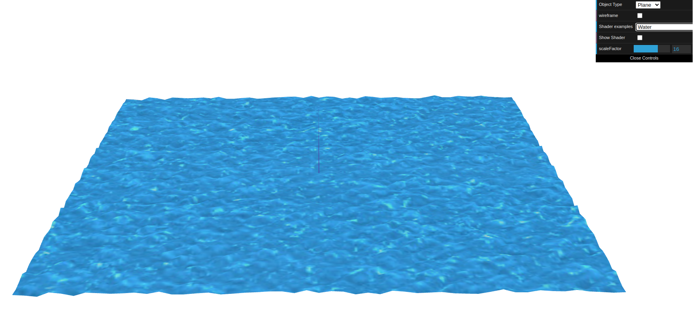

# CG 2022/2023

## Group T05G04

## TP 5 Notes

- Na primeira parte do exercício 1 criamos novos vertex e fragment shaders de modo a pintar a parte inferior do bule de azul e a parte superior de amarelo:

Figure 1: Bule Amarelo e Azul

- Na segunda parte do exercício 1 criamos um movimento no eixo XX seguindo uma onda sinusoidal. Depois o bule foi pintado segundo uma cor cinza baseada na sepia:

Figure 2: Bule Cinza

- No exercício 2 aplicamos a textura da água com shaders no plano. As coordenadas de textura foram animadas através do tempo e os vértices de acordo com as componentes da cor da textura, de forma a criar sensação de relevo.

Figure 3: Efeito de água
