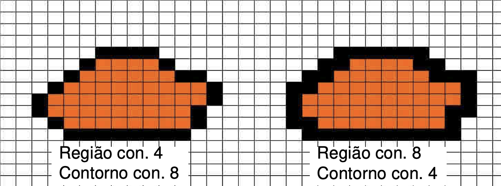

# Preenchimento de Regiões

## Conectividade

## 1 - Preenchimento segundo o contorno existente

### 1.1 - Por difusão (flood fill)

#### 1.1.1 - Limitado pelo contorno

Chamada recursiva a 4 ou 8 vizinhos, pára quando chegar ao contorno. Há problemas com froteiras incompletas e há consumo da stack.

#### 1.1.2 - Limitado ao interior da região

Chamada recursiva a 4 ou 8 vizinhos, pára quando chegar a uma cor que não é conhecida como sendo interior da região. Agora as fronteiras já podem ser incompletas, mas a stack continua a ser bastante usada.

### 1.2 - Por análise de contorno

Mais eficiente que os outros tópicos. Parte do ponto inicial, situado algures no interior, e apenas coloca na pilha alguns pontos. Algoritmo:

- Parte de um ponto interior, que começa por ser colocado na pilha;
- Se a pilha estiver vazia, o programa termina;
- Senão, retira-o da pilha e visita para a direita e em seguida para a esquerda, tomando nota do XLeft e XRight;
- Nas linhas imediatamente acima e abaixo encontra, até ao intervalo XLeft e XRight, os novos pontos de partida e coloca-os na pilha;
- Configura um ponto de partida:
    - Píxel de coordenada XRight;
    - Píxel imediatamente antes de um píxel do contorno;

## 2 - Preenchimento por varrimento segundo descrição de contorno

### 2.1 - Algoritmo de lista de pontos de fronteira ordenados

### 2.2 - Algoritmo de lista de arestas ativas

