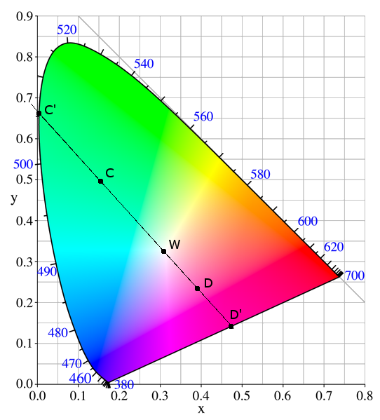

# Luz e Cor

O sistema visual que percebe a luz e a cor corresponde ao conjunto dos olhos (captação) com o cérebro (processamento da imagem). Os seres humanos só conseguem observar uma pequena parte da luz que o rodeia, a zona visível, que vai do vermelho até ao roxo.

## Luz Cromática

Em termos perceptivos avaliamos a luz cromática pelos seguintes critérios:
- `Matiz / Hue`, distingue entre várias cores, como o amarelo, vermelho e afins;
- `Saturação`, distância da cor ao cinzento de igual intensidade. Adicionando branco, as cores ficam menos saturadas;
- `Intensidade`: intensidade da luz refletida. É tão mais intenso quanto mais se distingue do preto. Adicionando preto, as cores diminuem a sua intensidade;
- `Brilho`: intensidade da luz emitida, como lâmpada, sol e afins;

O branco e todos os cinzas têm saturação zero. É necessário recorrer à física para caracterizar objetivamente a cor. A saturação também pode ser vista como o afastamento em relação ao branco em termos percentuais:

```note
Saturação = (ED - EW) / ED
    ED - Energia dominante no gráfico
    EW - Energia para o branco
```

### Resposta ao olho humano

O olho humano é composto por dois tipos de sensores:
- `Bastonetes`, são sensíveis a baixos níveis de iluminação e não distinguem cores;
- `Cones`, interpretam a cor e são pouco sensíveis com pouca luz;

Há cones são sensíveis de forma máxima à cor azul, vermelha e verde. No entanto esses estímulos não correspondem a percentagens iguais, pelo que é necessário fazer o ajuste quando passamos para cores do computador. Nesse caso:

```note
cinza = 21% RED + 72% GREEN + 7% BLUE
```

Na tabela de sensores há cores que possuem valores negativos em algumas gamas, pelo que em RGB/computador não é possível representar todas as cores que os seres humanos conseguem observar.

## Modelo CIE

Volume em formato cónico que contém as cores visíveis. Ente gráfico não possui luminância, apenas tem as cores com saturação máxima (puras) nas bordas e o branco ao centro.



De forma semelhante, a saturação define-se pela percentagem entre a distância à borda e a distância ao ponto central, o branco. A Matiz (Hue), que é no fundo a cor dominante de um ponto define-se pelo comprimento de onda da borda mais próxima.

- `Cores não espectrais`: não podem ser definidas por um comprimento de onda dominante, por exemplo as cores púrpuras e magentas.

A soma de cores de quaisquer dois pontos neste modelo não fica no ponto intermédio, porque precisamos da quantidade de cada uma (a luminânica), algo que não possuímos porque não temos profundidade. Mas podemos garantir que fica no segmento de reta que une esses mesmos pontos. <br>
Assim é de prever que também não é possível representar todas as cores deste diagrama, pois qualquer triângulo não preenche toda a sua área.

## Modelos de cores em Sistemas Raster

### Modelo RGB

Modelo aditivo das três componentes primárias, Red, Green e Blue. Representa-se por um cubo unitário onde o vértice (0,0,0) representa o preto e o (1,1,1) representa o branco.<br>
Em computadores cada componente representa-se por 8 bits (um total de 256 opções por componente), e também existe o **canal alpha**, que revela a transparência da cor nos meios digitais. A mudança do bit menos significativo não é perceptível ao olho humano.

### Modelo CMY

Usado para impressoras, onde as suas cores primárias são o Cyan, Magenta e Yellow, que são as cores complementares do Red, Green e Blue correspondentemente.<br>
É um modelo subtrativo, pois **absorve** a cor complementar à sua superfície. Por exemplo, se o papel for ciano, absorve a componente vermelha da luz que incide, ficando só visível a cor verde e azul, as componentes que vemos.

<TODO: inserir esquema dos apontamentos>