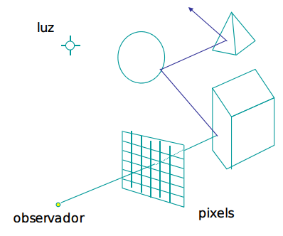

# Iluminação Global

Para calcular a cor de cada ponto em função:
- Da `iluminação direta` de uma fonte de luz, idêntica ao que se fazia com o modelo de iluminação global;
- Da `iluminação indireta`, proveniente da soma de todas as reflexões das superfícies próximas;

## Ray Tracing

É uma extensão do algoritmo de **Ray Casting**, que depende da posição do observador (*view dependent algorithm*).



Em cada iteração, parte do raio incidente é convertido em raio refletido (coeficiente de reflexão) e raio absorvido, perdendo intensidade à medida do tempo e do espaço percorrido. A cada novo polígono temos de calcular o novo polígono mais próximo na direção complementar.

### Vantagens

- Sombras, reflexões e refrações são facilmente incorporadas;
- Simula os efeitos especulares;

### Desvantagens

- O custo do cálculo de interseções é muito elevada;
- Não simula bem os efeitos de iluminação difusa;

### Otimizações

#### 1 - Diminuição do número de raios a processar

- `Item Buffers`, pré-processamento através do algoritmo Z-Buffer, onde se determina as áreas do ecrã onde se situam os objetos;
- `Adaptative Tree-Depth Control`, usa-se uma profundidade limitada da árvore de *shading* para economizar recursos. Um nó com pouca influência na cor do pixel-root pode ser descartado; 
- `Light-Buffers`, a cada fonte de luz associam-se listas com os objetos que a rodeiam, os chamados *shadow feelers*. São verificados primeiro, porque há uma grande probabilidade do próximo raio incidir num polígono contido nessa lista;

#### 2 - Diminuição do número de interseções a testar

- `Volumes envolventes`, colocar um objeto complexo dentro de uma caixa simples, normalmente de lados alinhados com os eixos. Se o raio não incidir na caixa, então o processamento é rápido (teste conservativo), senão temos de avaliar a forma complexa. Maos eficiente quanto menos espaços vazios houver dentro da caixa, normalmente neste critério é preferível formas retas (rectângulo, quadrado), do que formas circulares;
- `Organização Hierarquica dos Volumes Envolventes`, organizar os volumes envolventes de forma a terem uma hierarquia de *clusters*, formando uma árvore de pesquisa. Assim o número de iterações só depende da profundidade da árvore;
- `Divisão espacial em Grelhas Tridimensionais`, usando o algoritmo **3D DDA**, *Diagram Differencial Analyser*. O espaço é divido em cubos do mesmo tamanho que contêm uma lista de objetos (totais ou parciais) internos. Só as células que coincidirem com o raio é que serão avaliadas, permite econimizar muito espaço. Cada célula pode ainda ter uma hierarquia, para o algoritmo ser ainda mais eficiente.

## Radiosity

O algoritmo é independente do ponto de vista do observador e é divido em duas partes principais:

- Calcular a iluminação, ou seja, a interação entre objetos e fontes de luz. É aqui que incide a parte principal do algoritmo;
- Criar a imagem considerando o ponto de vista do observador, por exemplo com o Z-Buffer, que é o algoritmo mais comum;

Nesta situação, o algoritmo admite:

- Não há luz pontual;
- Todos os objetos são considerados fontes de luz;
- Trata apenas a iluminação difusa;
- Os polígonos têm sempre uma iluminação constante, pelo que às vezes é necessário parti-los em *patches*;

A radiosidade, que tem em consideração o objeto e tudo que ele emite nos outros, é dada pela seguinte fórmula:

```note
Bi - radiosidade (energia expelida)
EiAi - energia emitida em toda a área do polígono
pi - refletividade do material
Fij - fator de forma, percentagem de energia que abandona j e atinge i

BiAi = EiAi + pi sum(FjiBjAj)
```