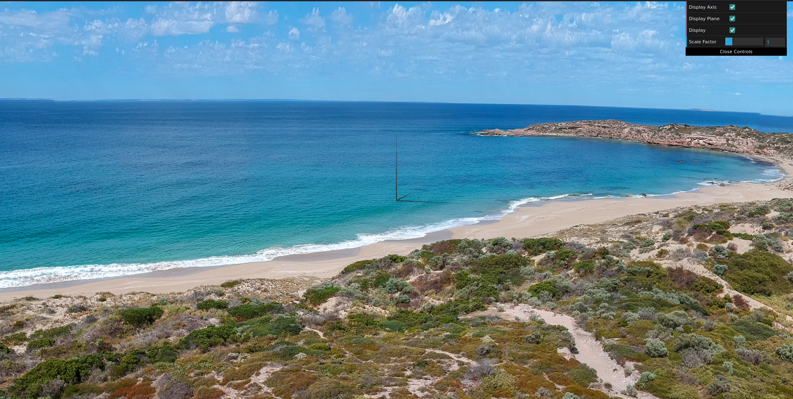
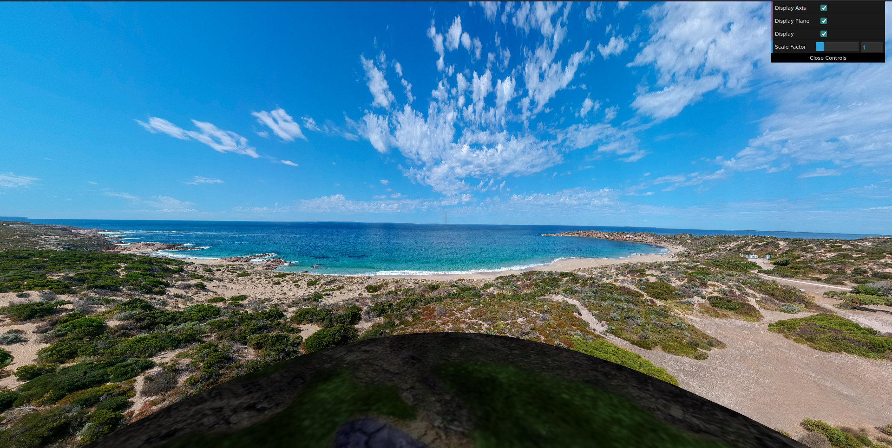
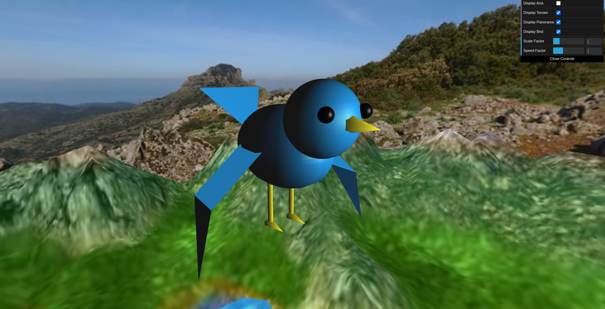
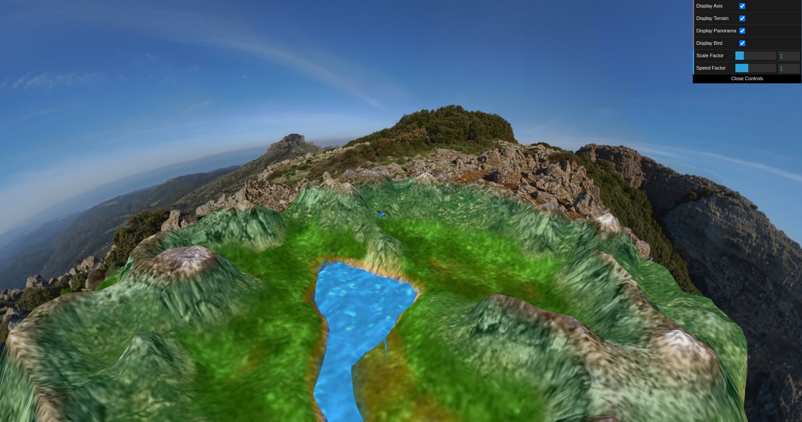
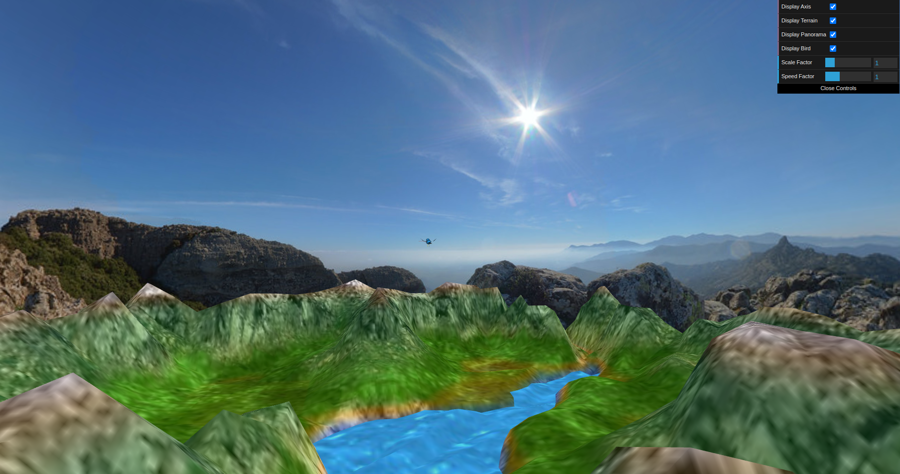
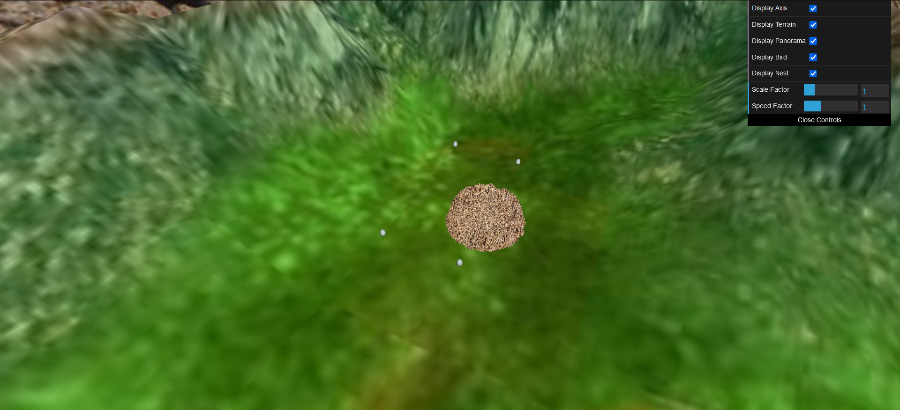
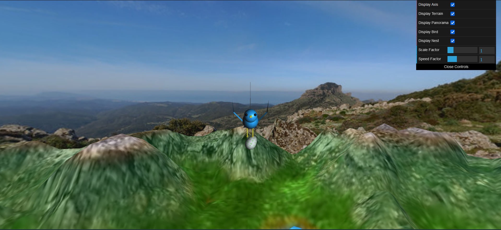
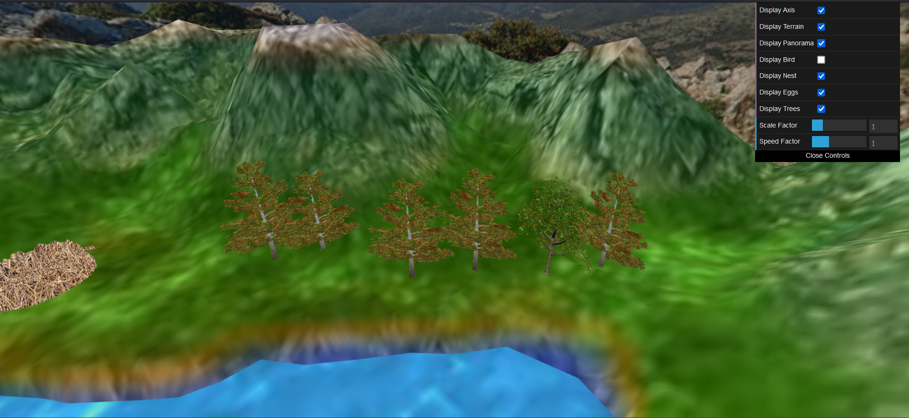
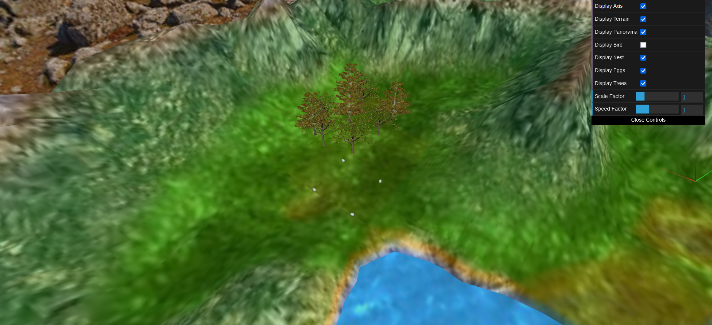
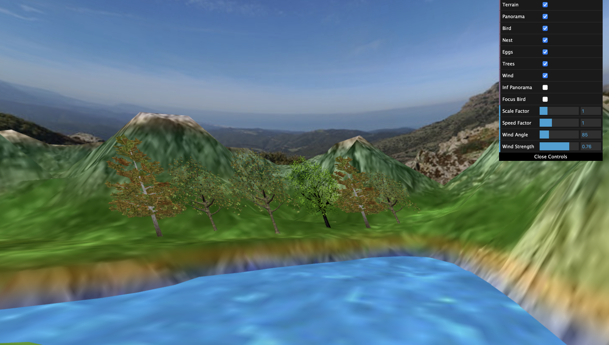

# CG 2022/2023

## Group T05G04

- Daniel Rodrigues - 202006562
- Fábio Sá - 202007658

## Project

### Topic 2

### Topic 3

### Topic 4

### Topic 5

### Topic 6

Textures: https://pngimg.com/image/92742 

### Topic 7

B. Deformação de árvores com o vento,com base no deslocamento de vértices dos quads respetivos.

